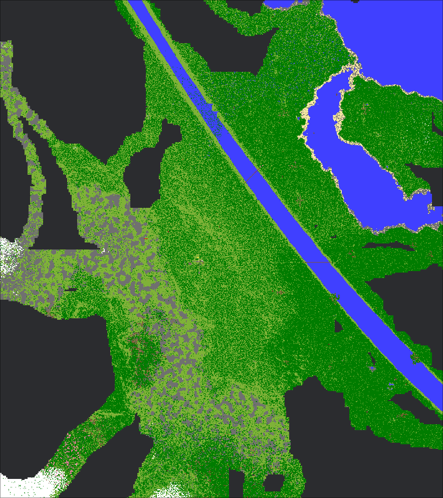

# Distant Horizons Rust

A reimplementation of some of the datastructures used in the minecraft mod.

### Distant Horizons

Modrinth: https://modrinth.com/mod/distanthorizons

Source: https://gitlab.com/distant-horizons-team/distant-horizons

## Features

- [x] Load DH data from sqlite database
- [x] Decompress section data (lzma2 supported, lz4 still missing)
- [x] Display LoDs of selected detail level (currently hardcoded)
- [x] Display blocks as they would in a minecraft map
- [x] Nether detection, which hides the nether roof
- [x] Move and zoom around the map
- [ ] UI to select world and dimension
- [ ] Select detail level based on zoom
- [ ] Show beacon marker
- [ ] Debug overlay (loading/decompression status, available detail levels)
- [ ] Mouse support (Drag'n'drop the map, wheel to zoom)

### Controls

- <kbd>L</kbd>: load the map
- <kbd>W</kbd><kbdA</kbd><kbdS</kbd><kbdD</kbd>: move around
- <kbd>+</kbd>/<kbd>-</kbd>: zoom
- <kbd>ESC</kbd>/<kbd>Q</kbd>: exit

## Example

</img>

We're playing with [JJThunder To The Max](https://modrinth.com/datapack/jjthunder-to-the-max) which amplifies the terrain a lot and without DH we could only see slivers of our world. This screenshot is more than 10.000 blocks wide and still only contains a beach area, the obvious river and the beginning of a mountain range.
The detail level is set to 8 (`DetailLevel::Chunk16`, a section is 16 chunks wide), which makes each pixel 4x4 blocks.

## Idea

At first this started as a way to verify that an external tool used to merge database files
from different players or machines wouldn't corrupt the data.
After implementation of the loading was done I was searching for a way to visualize the data,
but just rendering squares was more complicated than anticipated, so I switched to bevy,
which is a full game engine.
The rendering performance was good enough for data verification but I saw a lot of potential,
so I improved it a lot by rendering each section as an image,
which reduced the entity (every element in bevy is an entity) count by 64\*64=4096.
Since the fps was now at or above my monitor refresh rate, I implemented zooming and moving the camera.
To watch it while playing at the same time without needing to copy the database and restarting
the visualizer every time, I implemented reloading.
I was relieved when I noticed DH handled
a second process accessing the sqlite file at the same time without any problems.

One of the next goals would be to render different detail levels based on the current zoom.

## Thanks

Thanks to all the developers and their work put into DH <3. Your mod is truly awesome and makes a lot of us play minecraft again to view it in whole new perspective.
